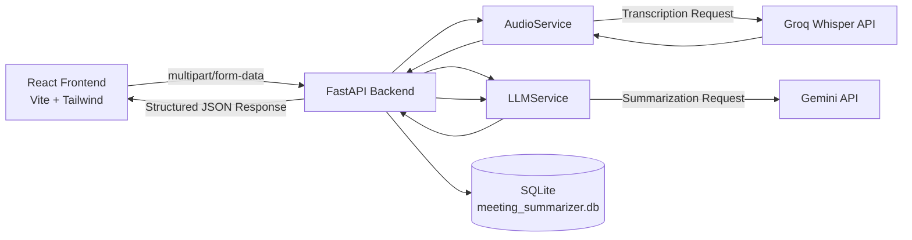

# AI Meeting Summarizer

DEMO VIDEO LINK : https://drive.google.com/file/d/1JMJkkqMoDsB3v_2KpUtRqVYQJBGDNi__/view?usp=drive_link

A production-minded prototype for technical hiring assessments that converts uploaded meeting audio into a grounded transcript plus a structured AI summary. The app is optimized for transcription reliability, low-hallucination summarization, modular backend design, and a graphite, case-file-style interface suitable for a recruiter or evaluator demo.

## Why This Stack

- `FastAPI` keeps the backend async-friendly, lightweight, and easy to reason about for file uploads plus API routing.
- `Groq Whisper Large v3` is the default ASR path because Groq offers a free tier, OpenAI-compatible speech endpoints, and a strong accuracy/speed profile for meeting transcription.
- `Gemini` is the default summarization model because its free tier supports structured JSON generation and gives strong prompt-following for extractor-style summaries.
- `React + Vite + Tailwind + Lucide` provides a fast setup path and enough design control to produce a polished UI instead of a generic CRUD screen.

## Design Direction

The UI follows a monochrome "case file" visual identity rather than a generic dark SaaS template:

- **Palette**: pure graphite/warm-black tones, no color accents.
- **Type**: `Space Grotesk` for headings, `Inter` for body copy, `JetBrains Mono` for anything that's structured/extracted data (status fields, the action-items table, file metadata) so machine-extracted content is visually distinct from prose.
- **Layout**: sharp-cornered bordered panels and hairline dividers instead of soft glowing cards, styled like a report or dossier.
- **Signature detail**: a rotated "grounded, no invented owners or dates" stamp in the hero, tying the visual language directly to the backend's anti-hallucination prompt constraints.

## System Architecture



## Data Persistence

Every successful `/api/summarize` call is saved to a local SQLite database (`backend/meeting_summarizer.db`, created automatically on first run) via `SQLModel`. This is a deliberate, minimal-footprint choice for a prototype: no external database server to provision, and the schema is defined directly from Pydantic-style models in `backend/database.py`.

Stored per record: filename, full transcript, executive summary, key decisions, action items, detected language, duration, and a timestamp.

Two read endpoints expose the history:

- `GET /api/summaries` — the most recent 50 saved summaries
- `GET /api/summaries/{id}` — a single saved summary by id

## Project Structure

```text
backend/
  .env.example
  config.py
  database.py
  main.py
  models.py
  requirements.txt
  services/
    audio_service.py
    llm_service.py
frontend/
  index.html
  package.json
  postcss.config.js
  tailwind.config.js
  vite.config.js
  src/
    App.jsx
    index.css
    main.jsx
    components/
      SummaryCard.jsx
README.md
```

## Prompt Engineering Strategy

The summarization layer is intentionally constrained instead of relying on a generic "Summarize this" instruction. The backend uses a dedicated system prompt that:

- forces grounded extraction from the transcript only
- bans invented owners, deadlines, and decisions
- enforces an exact three-sentence executive summary
- separates finalized decisions from unresolved discussion
- requires JSON-only output for reliable parsing
- includes a few-shot example to anchor the response format and quality bar

This makes the prototype look deliberate in an assessment setting because evaluators can see that summary quality was treated as a product and architecture concern, not just an API call.

## Exact System Prompt Used In Backend

The prompt below is embedded directly in [backend/services/llm_service.py](</D:/Meeting Summarizer/backend/services/llm_service.py:1>):

```text
You are an expert meeting analyst for technical and business discussions.

Your task is to transform a raw meeting transcript into a precise JSON object.
You must be conservative, grounded, and non-speculative.

Rules:
1. Use only information explicitly stated in the transcript.
2. Never invent decisions, owners, dates, blockers, or next steps.
3. If an owner is not clearly mentioned, use "Unassigned".
4. If a deadline is not clearly mentioned, use "Not specified".
5. The executive summary must be exactly 3 sentences.
6. Each key decision must describe a finalized or strongly confirmed decision. Do not include open questions.
7. Each action item must be concrete and execution-oriented.
8. If the transcript does not contain any finalized decisions, return an empty array for key_decisions.
9. If the transcript does not contain any action items, return an empty array for action_items.
10. Return valid JSON only. Do not wrap the JSON in markdown fences or prose.

Required JSON schema:
{
  "executive_summary": "string",
  "key_decisions": ["string"],
  "action_items": [
    {
      "task": "string",
      "owner": "string",
      "deadline": "string"
    }
  ]
}

Few-shot example:
Transcript:
"Priya confirmed we will ship the beta dashboard on September 15. Alex will finalize the API contract by next Tuesday. The team agreed to postpone SSO until phase two."

Expected JSON:
{
  "executive_summary": "The team aligned on the near-term release plan for the beta dashboard. They confirmed the shipping target and narrowed scope by deferring non-critical work. A follow-up task was assigned to finalize the API contract before implementation continues.",
  "key_decisions": [
    "The beta dashboard will ship on September 15.",
    "SSO is postponed until phase two."
  ],
  "action_items": [
    {
      "task": "Finalize the API contract.",
      "owner": "Alex",
      "deadline": "next Tuesday"
    }
  ]
}
```

## Windows + VS Code Setup

### 1. Open the project

- Open `D:\Meeting Summarizer` in Visual Studio Code.
- Open a new terminal in VS Code.

### 2. Set up the Python backend

```powershell
cd D:\Meeting Summarizer\backend
python -m venv .venv
.venv\Scripts\Activate.ps1
python -m pip install --upgrade pip
pip install -r requirements.txt
Copy-Item .env.example .env
```

Update `.env` with your API keys:

```env
GROQ_API_KEY=your_groq_api_key
GEMINI_API_KEY=your_gemini_api_key
LLM_PROVIDER=gemini
LLM_MODEL=gemini-3.7-flash
ASR_PROVIDER=groq
ASR_MODEL=whisper-large-v3
MAX_FILE_SIZE_MB=25
CORS_ORIGINS=http://localhost:5173
```

Run the backend:

```powershell
uvicorn main:app --reload
```

The API will be available at `http://127.0.0.1:8000`.

### 3. Set up the React frontend

Open a second VS Code terminal:

```powershell
cd D:\Meeting Summarizer\frontend
npm install
```

Create a frontend environment file:

```powershell
Set-Content .env "VITE_API_BASE_URL=http://127.0.0.1:8000"
```

Run the frontend:

```powershell
npm run dev
```

The UI will be available at `http://127.0.0.1:5173`.

## API Contract

### `POST /api/summarize`

Form data:

- `file`: audio file upload

Response shape:

```json
{
  "filename": "standup.mp3",
  "transcription": "full transcript text...",
  "executive_summary": "Three sentence overview...",
  "key_decisions": ["Decision one", "Decision two"],
  "action_items": [
    {
      "task": "Finalize API schema",
      "owner": "Aman",
      "deadline": "Friday"
    }
  ],
  "detected_language": "english",
  "duration_seconds": 523.4
}
```

## Assessment-Focused Notes

- The backend keeps transcription and summarization concerns separated into service modules for readability and testability.
- The frontend uses explicit loading states such as `Transcribing...` and `Extracting insights...` to make the demo feel responsive.
- Upload validation is handled before the ASR request to surface clear errors for unsupported formats and oversized files.
- The default provider split is deliberate: Groq handles fast, free-tier transcription while Gemini handles structured extraction with JSON schema guidance.
- The result view is intentionally structured for recruiter readability rather than raw model output.

## Recommended Next Upgrades

- Add diarization-aware rendering for multi-speaker meetings.
- Add automated tests for prompt contract validation and API upload edge cases.
- Introduce background task handling for longer recordings.
